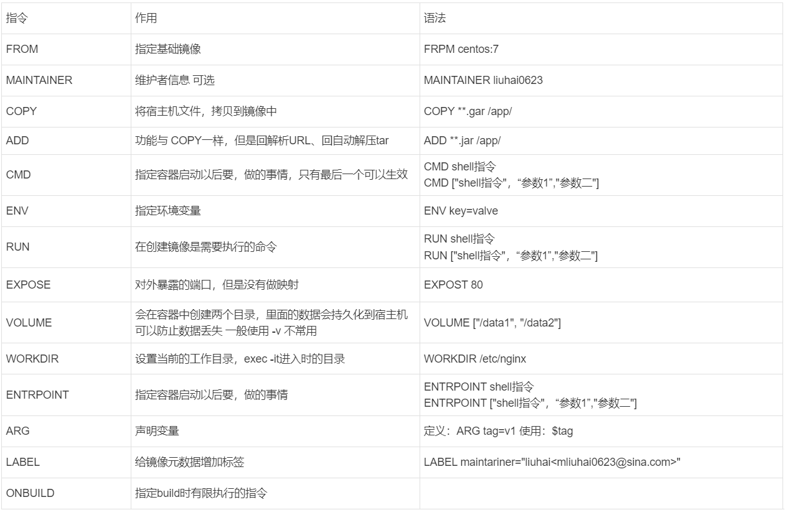

# Docker基础

---
## 一、Namespace 命名空间
#### 1、MNT Namespace - 磁盘挂载点和文件系统的隔离
>在容器里面是不能访问宿主机的资源的，宿主机使用了chroot技术把容器锁定到一个制定的运行目录里面
/var/lib/containerd/io.containerd.runtime.v2.task/moby/容器ID

#### 2、IPC Namespace - 进程通信的隔离
> 一个容器允许在容器内的不同进程相互访问，但是不能夸容器访问

#### 3、UTS Namespace - 主机命隔离
> 默认是主机名是容器ID
#### 4、PID Namespace - 进程隔离
> 一般一个容器内的主父进程是 1 相当于centos 的systemd，容器内的 的进程都会映射到宿主机
#### 5、Net Namespace - 网络隔离
> 每个容器都有自己的网卡、ip （默认会有一个 docker0 网桥，上面会有veth***的网口） \
> 查看网桥： brctl show \
net.ipv4.ip_forward = 1 才能上网 目的地址转换
#### 6、User Namespace - 用户隔离

---
## 二、Linux CGROUPS 资源限制
Linux control groups 用于限制一个进程组能够使用的资源上线、包括CPU、内存、磁盘、网络带宽等，还能够对进程进行优先级设置，以及对进程进行挂起和恢复等等操作。
```shell
#： cat /boot/config-3.10.0-1160.el7.x86_64 | grep CGROUP | grep -v "#"
CONFIG_CGROUPS=y
CONFIG_CGROUP_FREEZER=y
CONFIG_CGROUP_PIDS=y
CONFIG_CGROUP_DEVICE=y
CONFIG_CGROUP_CPUACCT=y
CONFIG_CGROUP_HUGETLB=y
CONFIG_CGROUP_PERF=y
CONFIG_CGROUP_SCHED=y
CONFIG_BLK_CGROUP=y
CONFIG_NETFILTER_XT_MATCH_CGROUP=m
CONFIG_NET_CLS_CGROUP=y
CONFIG_NETPRIO_CGROUP=y
CONFIG_MEMCG=y
CONFIG_MEMCG_SWAP=y
CONFIG_MEMCG_SWAP_ENABLED=y
CONFIG_MEMCG_KMEM=y
```
---

## 三、Docker数据卷 volume
>host volume 容器 和 主机的目录都写出来   -v /home:/docker-home \
> named volume 具名模式   容器目录确认 主机目录系统分配  -v mysqdata:/var/lib/mysql \
> anonymous volume 匿名模式   不写宿主机 目录 只写 容器目录 主机目录系统分配 -v /var/lib/mysql

---
## 四、安装Docker并配置镜像加速
#### 1、环境准备
- Centos7.9 64
- selinux关闭、firewalld关闭
#### 2、常用软件、yum源、安装
```shell
# 安装常用软件
yum update -y && yum -y install  wget psmisc vim net-tools nfs-utils telnet yum-utils device-mapper-persistent-data lvm2 git tar curl bash-completion gcc ggc-c++
# 添加docker-ce源
yum-config-manager --add-repo http://mirrors.aliyun.com/docker-ce/linux/centos/docker-ce.repo
# 查看版本
yum list docker-ce.x86_64 --showduplicates | sort -r
# 安装
yum -y install docker-ce
# Step 4: 开启Docker服务
systemctl enable --now docker && systemctl status docker
```
#### 3、开启包转发和修改内核参数
```shell
# 加载模块
modprobe br_netfilter
# 修改内核参数
cat > /etc/sysctl.d/docker.conf <<EOF
net.bridge.bridge-nf-call-ip6tables = 1
net.bridge.bridge-nf-call-iptables = 1
net.ipv4.ip_forward = 1
EOF
# 加载内核参数
sysctl -p /etc/sysctl.d/docker.conf
# 重启docker
```
#### 4、配置镜像加速器
针对Docker客户端版本大于 1.10.0 的用户 您可以通过修改daemon配置文件/etc/docker/daemon.json来使用加速器
```shell
sudo mkdir -p /etc/docker
sudo tee /etc/docker/daemon.json <<-'EOF'
{
  "registry-mirrors": ["https://qaxkgqss.mirror.aliyuncs.com"]
}
EOF
sudo systemctl daemon-reload
sudo systemctl restart docker
```
---

## 五、使用Docker
```shell
# 查找镜像
docker searche centos
# 拉取镜像
docker pull centos:centos7.9.2009

# 当前机器不能联网
# 使用保存
docker save -o centos.tat.gz centos:centos7.9.2009
# 然后解压
docker load -i centos.tat.gz

# 镜像最终存储位置
ls /var/lib/docker/image/overlay2/imagedb/content/sha256/

# 镜像打标签
docker tag centos:centos7.9.2009 centos:v1

# 运行容器 
docker run -d --name web-01 -p 80:80 nginx:1.22 # -p 映射端口 -P 映射随机端口

# 重命名容器
docker rename id/name newname 

# 进入容器
docker exec -it id/name /bin/bash    # 退出不会杀四其他bash
docker # 退出会导致容器停止 不建议使用

# 停止容器 
docker stop id/name    # 停止 
docker kill id/name    # 杀死
docker pause id/name     # 暂停
docker start id/name     # 启动

# 删除容器
docker rm -f id/name # -f 强制删除

# 删除镜像
docker rmi -f id/name # -f 强制删除

# 构建镜像
docker build -t liuhai/nginx:v1 .
# -f 指定 dockerfile 文件名

# 查看容器
docker ps    # 运行的容器
docker ps -a # 停止和运行的容器
docker pa -qa # -q 只显示ID  

# 查看容器运行入职
docker logs id/name

# 查看容器的信息
docker inspect id/name
```
---
## 六、Docker资源限制
### 1、CPU篇
#### a、对cpu进行份额设置
```shell
# 对cpu进行份额设置，只有竞争的时候才会生效 --cpu-shares=512
# 默认分配份额事 1024
docrun -d --name my_nginx -p 8080:80 --cpu-shares=512 nginx 
# 查看cpu份额
# 进入容器
root@a189e00c26cc:/# cat /sys/fs/cgroup/cpu/cpu.shares
512
```
#### b、指定容器运行在指定CPU和内存节点上运行
```shell
# 指定容器运行在指定CPU上
docker run -d --name my_nginx -p 8080:80 --cpuset-cpus=0,1,2,3 nginx 
# 查看容器运行到那些cpu上
# 进入容器
cat /sys/fs/cgroup/cpuset/cpuset.cpus
root@a189e00c26cc:/# cat /sys/fs/cgroup/cpuset/cpuset.cpus
0-3
```
#### c、CPU控制周期
```shell
# --cpu-period 单位为微秒 指定了CPU资源在多长时间内可以被容器使用。默认为0.1秒 范围：1000微秒~~1秒
# --cpu-quota 单位为微秒 指定容器可以在每个cpu周期内使用CPU的最大量 。 默认为-1 不控制 范围
docker run -it --name docker-01 --cpu-period=10000 --cpu-quota=0.2 centos:centos7.9.2009 bash
```
### 2、内存篇
#### a、限制容器使用内存大小
```shell
# 限制容器使用的内存
docker run -it -m 256m centos:centos7.9.2009
[root@0385fbaee3d4 /]# cat /sys/fs/cgroup/memory/memory.limit_in_bytes 
268435456
# 1M = 1,048,756字节

# 模拟压测
yum -y install epel-release 
yum -y install stress-ng
# 测试
stress-ng --vm-bytes 1024M --vm-keep -m 1
```

### 3、磁盘IO篇
```shell
# --device-write-bps 设备:value 限制容器向指定设备写入的字计数/秒
# dovice-read-bps 设备:value 限制容器从指定设备读取字节数/秒
# 单位 默认字节 B

docker run --rm -it --device /dev/sda:/dev/sda --device-write  /dev/sda:1mb -v /mnt:/data --name docker-01 centos:centos7.9.2009
# 测试
time dd if=/dev/sda of=/data/test.out bs=1M count=50 oflag=direct,nonblock
```

## 七、Dockerfile



## 八、四种网络模式
### host 模式
>--net=host  一般用于 容器需要直接访问主机资源的场景
### none 模式
>--net=none 容器不会创建ip
### bridge 模式
>--net=bridge docker 默认网络模式，基于虚拟网桥实现
### centainer 模式
>--net=centainer:另一个容器的名字 两个容器公用同一个ip 一般用于两个容器使用localhost通行